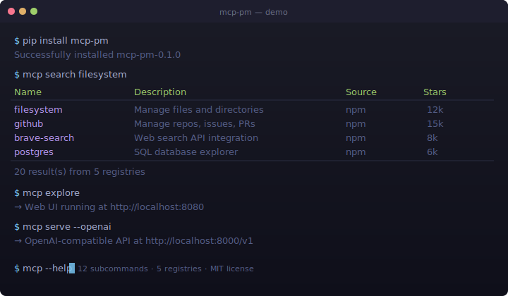

<p align="center">
  
  
  
  
  
  
  
  
  
</p>

<div align="center">

[简体中文](README.zh-CN.md) | English

</div>

<h1 align="center">⛭ mcp-pm — Homebrew for MCP Servers</h1>

<p align="center">
  <em>A CLI package manager for the Model Context Protocol ecosystem. Install, search, serve, and manage MCP servers with a single command.</em>
</p>

<p align="center">
  <a href="#-quick-start">Quick Start</a> •
  <a href="#-features">Features</a> •
  <a href="#-commands">Commands</a> •
  <a href="#-architecture">Architecture</a> •
  <a href="#-comparison">Comparison</a> •
  <a href="#-registry-backends">Registries</a>
</p>

---

<p align="center">
  
</p>

---
## ✨ Quick Start

```bash
# Install
pip install mcp-pm

# Search for MCP servers across 5 registries (Smithery, npm, PyPI, built-in...)
mcp search filesystem

# Install a server
mcp install mcp-server-filesystem

# List installed servers
mcp list

# Explore the Web UI dashboard
mcp explore

# Run a server in an isolated sandbox
mcp sandbox my-server --level docker

# Start an OpenAI-compatible HTTP proxy
mcp serve
```

> **No servers installed yet?** Run `mcp search database` to discover servers from the community registry, or `mcp explore` to browse them visually.

---

## 🚀 Features

| Feature | Description |
|---------|-------------|
| **🔍 Multi-Registry Search** | Search across **5 registries** simultaneously — Smithery (5,000+ servers), npm, PyPI, built-in curated list |
| **📦 One-Command Install** | `mcp install <server>` — installs from npm, pip, git, or Docker |
| **🔒 Sandbox Isolation** | Run untrusted servers in isolated environments (subprocess, Docker) |
| **🌐 Web UI Dashboard** | Beautiful dark-themed HTMX dashboard for visual management |
| **⚡ OpenAI Proxy** | Expose all installed MCP tools as an OpenAI-compatible API |
| **🛡️ `mcp doctor`** | Diagnostic tool that checks your entire MCP setup |
| **🔧 12 Commands** | Full lifecycle management — install, uninstall, update, list, search, info, explore, serve, sandbox, config, doctor, run |
| **🌍 Multi-language UI** | Web UI supports English and 中文 (Chinese), extensible to any language |
| **📝 YAML Config** | Human-readable configuration at `~/.mcp-pm/config.yaml` |
| **🎨 Beautiful CLI** | Rich terminal output with tables, colors, and progress spinners |

---

## 🎮 Commands

| Command | Description | Example |
|---------|-------------|---------|
| `mcp install` | Install an MCP server | `mcp install mcp-server-filesystem` |
| `mcp uninstall` | Remove an installed server | `mcp uninstall my-server` |
| `mcp update` | Update all installed servers | `mcp update` |
| `mcp list` | List installed servers and tools | `mcp list` |
| `mcp search` | Search across all registries | `mcp search database` |
| `mcp info` | Show detailed server info | `mcp info github` |
| `mcp explore` | Launch the Web UI dashboard | `mcp explore` |
| `mcp serve` | Start HTTP proxy server | `mcp serve` |
| `mcp sandbox` | Run server in sandbox | `mcp sandbox my-server --level docker` |
| `mcp config` | Manage configuration | `mcp config get servers` |
| `mcp doctor` | Diagnose installation health | `mcp doctor` |
| `mcp run` | Run an MCP tool directly | `mcp run my-server tool-name` |

---

## 🏗️ Architecture

```
┌─────────────────────────────────────────────────────────────┐
│                    User Interfaces                          │
│  ┌──────────┐  ┌────────────┐  ┌──────────┐  ┌──────────┐  │
│  │  CLI     │  │ Web UI     │  │ VS Code  │  │ CI/CD    │  │
│  │ Terminal │  │ Dashboard  │  │ Ext.     │  │ Actions  │  │
│  └────┬─────┘  └─────┬──────┘  └────┬─────┘  └────┬─────┘  │
└───────┼──────────────┼──────────────┼──────────────┼────────┘
        │              │              │              │
        ▼              ▼              ▼              ▼
┌─────────────────────────────────────────────────────────────┐
│                    CLI Core (click + rich)                   │
│  ┌─────────────────────────────────────────────────────────┐│
│  │    12 Subcommands: install · uninstall · list · search  ││
│  │    info · explore · serve · sandbox · config · update   ││
│  │    doctor · run                                          ││
│  └─────────────────────────────────────────────────────────┘│
│  ┌──────────┐  ┌──────────┐  ┌──────────┐  ┌─────────────┐ │
│  │ Installer│  │ Config   │  │ Sandbox  │  │ HTTP Proxy  │ │
│  │ (multi-  │  │ (YAML)   │  │ (Docker  │  │ (OpenAI     │ │
│  │  source) │  │          │  │  isol.)  │  │  Compat.)   │ │
│  └──────────┘  └──────────┘  └──────────┘  └─────────────┘ │
└───────────────────┬─────────────────────────────────────────┘
                    │
                    ▼
┌─────────────────────────────────────────────────────────────┐
│                  Registry Integrations                       │
│  ┌────────────┐  ┌──────────┐  ┌──────────┐  ┌──────────┐  │
│  │ Smithery   │  │ npm      │  │ PyPI     │  │ Built-in │  │
│  │ 5,000+ srvs│  │ Registry │  │ Registry │  │ 27 srvs  │  │
│  └────────────┘  └──────────┘  └──────────┘  └──────────┘  │
└───────────────────┬─────────────────────────────────────────┘
                    │
                    ▼
┌─────────────────────────────────────────────────────────────┐
│                  Execution Environment                       │
│  ┌──────────────┐  ┌──────────────┐  ┌───────────────────┐  │
│  │ Subprocess   │  │ Docker       │  │ OpenAI API Proxy  │  │
│  │ Direct Spawn │  │ Sandbox      │  │ MCP → OpenAI     │  │
│  └──────────────┘  └──────────────┘  └───────────────────┘  │
└─────────────────────────────────────────────────────────────┘
```

---

## 📦 Registry Backends

mcp-pm aggregates servers from **5 registries** simultaneously:

| Registry | Status | Servers | Type |
|----------|--------|---------|------|
| **Built-in** | ✅ Always available | 27 curated | Offline |
| **Smithery** ([smithery.ai](https://smithery.ai)) | ✅ Online | 5,000+ | API |
| **npm** ([npmjs.com](https://npmjs.com)) | ✅ Online | All mcp-server packages | API |
| **PyPI** ([pypi.org](https://pypi.org)) | ✅ Online | All MCP Python packages | API |
| MCP.so | ⚠️ Deprecated (API retired) | — | Graceful fallback |
| GitHub Registry | ⚠️ Temporarily unavailable | — | Graceful fallback |

All backends are queried **in parallel** with a 3-second timeout — you always get results fast.

---

## 🔄 Comparison

| Feature | **mcp-pm** | MCP.so | Smithery | GitHub Registry |
|---------|:----------:|:------:|:--------:|:---------------:|
| CLI-first | ✅ | ❌ | ❌ | ❌ |
| Offline mode (built-in index) | ✅ | ❌ | ❌ | ❌ |
| Sandbox isolation | ✅ | ❌ | ❌ | ❌ |
| Interactive TUI | ✅ | ❌ | ❌ | ❌ |
| Multi-registry search | ✅ | ❌ | ❌ | ❌ |
| Web UI dashboard | ✅ | ✅ | ✅ | ✅ |
| Auto-config generation | ✅ | ❌ | ❌ | ❌ |
| Open-source + self-hostable | ✅ | ❌ | ❌ | ✅ |
| OpenAI-compatible proxy | ✅ | ❌ | ❌ | ❌ |
| 12 subcommands | ✅ | — | — | — |

---

## 🛠️ Development

```bash
# Clone and set up
git clone https://github.com/weinotes/mcp-pm.git
cd mcp-pm
python3 -m venv .venv
source .venv/bin/activate
pip install -e ".[dev,web]"

# Run tests
python -m pytest tests/ -v --tb=short

# Start Web UI
mcp explore

# Lint
ruff check .
ruff format --check .
```

---

## 🤝 Contributing

Contributions are welcome! Please see [CONTRIBUTING.md](CONTRIBUTING.md) for guidelines.

- **Bug reports**: [Open an issue](https://github.com/weinotes/mcp-pm/issues/new?template=bug_report.md)
- **Feature requests**: [Start a discussion](https://github.com/weinotes/mcp-pm/issues/new?template=feature_request.md)
- **Security issues**: See [SECURITY.md](SECURITY.md)

---

## 📄 License

MIT License — Copyright (c) 2025-2026 Davey Wong <wgwcko@gmail.com>

---

<p align="center">
  <sub>Made with ❤️ by Davey Wong</sub>
</p>

